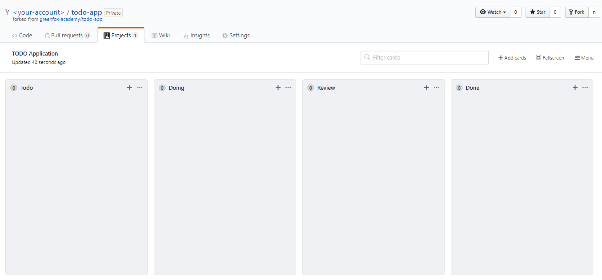

# Project: TODO Application

> Write a command-line todo application to easily keep track of your day-to-day tasks.
> To follow the state of our projects and manage our work, we use so-called Kanban Boards. They usually contain our tasks separated in columns. (todo, doing, review, done)
> Create a Kanban Board for yourself and add the stories that need to be done. 
> Later on, update your board so you can always see your project's state and your next steps.

## How to create your Kanban Board and where to work?

 -  Fork this repository under your own account.
 -  Clone the forked repository to your computer.
 -  Add link to the README.md of your usual repository of this new forked repo.
 -  Add tag to your new, forked repository with the name of your class.
 -  You will develop your todo application in this repository. In other words you will push to this repository.
 -  **Do not forget to add `.gitignore`.**
 -  In your new repository in the Projects view, create a new project called *TODO Application*
 -  Then create your board. It should consist the following columns
     -  Todo
     -  Doing
     -  Review
     -  Done
 -  Add the stories to your board

 -  It should look something like this. (obviously yours should have the stories added)

 -  You should not have more than 2 stories in the doing phase. If you already have a few stories in the review phase show them to a mentor.
 -  For more information about why we use kanban, check [this](https://www.youtube.com/watch?v=R8dYLbJiTUE) video.

## Specification

 -  This is **a complex exercise**, so please read through the whole [specification](specification.md) first, then start at the beginning.
 